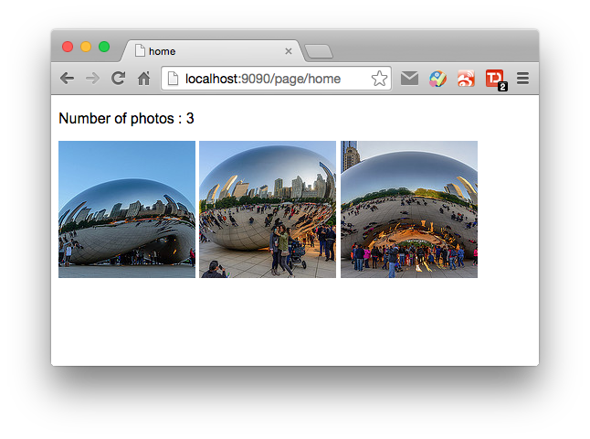

##Template Demo

###Results


###Basic.html

The basic template for all the pages.

```html
<!DOCTYPE html>
<html>
<head>
<title> {{PAGE_NAME}} </title>
</head>
<body>
<script src="/content/jquery-2.1.0.min.js"></script>
<script src="/content/mustache.js"></script>
<script src="/content/{{PAGE_NAME}}.js"></script>
</body>
</html>
```

`{{PAGE_NAME}}` will be replaced by the page name in url `http://example.com/page/PAGE_NAME`

###{{PAGE_NAME}}.js

The logic script for each page.

* load the template for this page
* load the data for this page
* assemble the page using mustache.js

example: home.js
```javascript
$(function(){
    var tmpl;
    tdata = {};

    var initPage = function() {
        $.get('/template/home.html', function(d){
            tmpl = d;
        });

        $.getJSON("/albums/chicago2014.json", function(d) {
            $.extend(tdata, d.data);
        });

        $(document).ajaxStop(function() {
            var html = Mustache.to_html(tmpl, tdata);
            $("body").html(html);
        });
    }();
});
```
